# docbase

**AI-powered conversational twins for documents, portfolios, and career profiles.**

Owners attach knowledge sources — Google Drive folders, PDFs, markdown files, URLs, or manual notes — and docbase turns them into a grounded, on-policy chat surface. Visitors ask questions in natural language. The system retrieves the most relevant passages, generates a faithful answer, and judges that answer before it is ever shown — all without exposing raw secrets, proprietary implementation details, or unbounded speculation.

---

## Why This Exists

Knowledge lives in scattered places: Drive folders, résumés, briefs, internal docs. People and teams need a **single conversational surface** that stays grounded, traceable, and on-policy — while still feeling like a real person or product, not a generic chatbot.

The core product artifact is the **Knowledge Twin** — a named AI persona attached to curated sources, with its own memory, persona configuration, and sharing surface. Twins can be scoped to a single person (a career twin, a portfolio twin) or to a team workspace (a product knowledge base, a client-facing research twin).

This is a production RAG system with explicit guardrails. It is not a single-shot `complete()` demo.

---

## Architecture at a Glance

```
┌─────────────────────────────────────────────────────────────────────┐
│                           FRONTEND (React + Vite)                   │
│    Owner dashboard · Twin config · Public share pages · Chat UI     │
└───────────────────────────┬────────────────────────────┬────────────┘
                            │ REST /api/v1/*              │
┌───────────────────────────▼────────────────────────────▼────────────┐
│                         FASTAPI BACKEND                             │
│                                                                     │
│   ┌──────────┐  ┌──────────┐  ┌────────────┐  ┌───────────────┐   │
│   │  Twins   │  │ Sources  │  │  Retrieval │  │  Answering    │   │
│   └──────────┘  └──────────┘  └────────────┘  └───────────────┘   │
│   ┌──────────┐  ┌──────────┐  ┌────────────┐  ┌───────────────┐   │
│   │  Chat    │  │  Policy  │  │   Memory   │  │  Evaluation   │   │
│   └──────────┘  └──────────┘  └────────────┘  └───────────────┘   │
│   ┌──────────┐  ┌──────────┐  ┌────────────┐                       │
│   │  Users   │  │  Sharing │  │  Embedding │                       │
│   └──────────┘  └──────────┘  └────────────┘                       │
│                                                                     │
│         ARQ WORKERS (background ingestion + memory jobs)            │
└───────────────────────────┬────────────────────────────┬────────────┘
                            │                            │
              ┌─────────────▼──────────┐    ┌───────────▼────────────┐
              │  PostgreSQL + pgvector │    │    Redis (job queue)    │
              │  (chunks · embeddings  │    │    ARQ task broker      │
              │   sessions · sources)  │    └────────────────────────┘
              └────────────────────────┘
```

**Modular monolith:** `backend/app/domains/{chat, answering, retrieval, policy, memory, twins, connectors, embedding, evaluation, sharing, ...}` with a clean API surface under `backend/app/api/v1/`.

Full domain model and data flow: [`docs/architecture.md`](docs/architecture.md)

---

## The Data Model

```
User
 └── Workspace(s)
       └── Twin(s)          ← the core product artifact
             ├── Source(s)  ← Google Drive · PDF · Markdown · URL · Manual
             │     └── Chunks (stored in pgvector)
             ├── TwinConfig
             │     ├── custom_context  (owner-written persona notes)
             │     └── memory_brief    (LLM-synthesised knowledge summary)
             ├── ChatSession(s)
             └── ShareSurface(s)  ← public slug-based pages
```

---

## Process 1 — Ingestion Pipeline

When a source is attached, an ARQ background job handles everything. The HTTP request returns immediately; the browser shows a syncing state.

### Step-by-step

| Step | What happens | Why |
|------|-------------|-----|
| **Enqueue** | API creates source row (`status: pending`), enqueues `ingest_source` job via ARQ + Redis | Ingestion can take minutes — blocking HTTP would time out |
| **Token resolve** | Google Drive OAuth refresh token decrypted (AES-256-GCM) → fresh access token fetched if expired | Access tokens expire in 1 hour; transparent auto-refresh |
| **Connector fetch** | Connector returns `ConnectorResult` (list of `RawFile` objects + delta cursor) | Full sync on first attach; cursor-based delta sync on subsequent runs |
| **Policy check** | Every file checked against hardcoded block list: `.env`, `*.pem`, `*.key`, `id_rsa`, DB dumps, credential files | Blocked files are silently skipped — security guarantee enforced before any content is read |
| **Secret scan** | Content scanned for inline secrets: API keys (OpenAI, AWS, Stripe, GitHub), private key headers, connection strings, JWTs | File names give no signal — `architecture-notes.md` can contain `sk-...` |
| **Chunking** | Markdown/text: split at heading boundaries (##, ###) → sections > 2,000 chars split further → 200-char overlap between pieces. PDFs: text extracted by pypdf then same strategy | 2,000 chars ≈ 400–500 tokens; overlap prevents split-boundary information loss |
| **Embedding** | Each chunk embedded in batches of 256 using provider with failover | Provider failure → failover, ingest continues; cache table avoids re-embedding identical text |
| **Storage** | Chunk rows written to `chunks` table (pgvector) with `id`, `content`, `embedding`, `source_ref`, `content_hash`, `token_count`, `snapshot_id` | Single store for vectors + metadata = transactional deletes, native hybrid SQL queries |
| **Memory Brief** | Separate ARQ job `generate_memory_brief` runs after chunks are ready | Incremental LLM merge: new source's chunks + existing brief → updated brief; Redis lock prevents concurrent twin writes |

### Embedding providers

| Provider | Model | Dimensions | Role |
|----------|-------|------------|------|
| OpenAI | text-embedding-3-small | 1536 | Default |
| Jina AI | jina-embeddings-v3 | 768 | Failover / lower cost |
| Voyage AI | voyage-3.5-lite | 512 | Compact, short docs |
| Local stub | SHA256-based | configurable | Dev only |

**Critical rule:** source rows store `embedding_provider + embedding_model + embedding_dimensions`. Delta syncs always read these and use the same profile — you cannot mix vector spaces.

### The Memory Brief

Stored in `TwinConfig.memory_brief`, not as a chunk. It is an LLM-synthesised paragraph-level overview of everything a twin knows:

> *"Cynthia Omovoiye is a product manager with 7 years of experience across fintech and healthtech. She has led teams at [company], shipped [products], and holds expertise in [areas]..."*

Why this matters: "Tell me about yourself" has no matching chunk in any document. The brief is injected unconditionally into every answer prompt — even when retrieval returns nothing — so identity and overview questions always get a grounded answer.

**Code:** `app/jobs/ingestion.py` → `generate_memory_brief()`, `app/domains/memory/service.py`

---

## Process 2 — Answering Pipeline

Every chat message triggers this in real time. Target latency: 2–4 seconds end-to-end.

### Step-by-step

```
Visitor: "What does the Eshicare SA brief say about pricing?"
                           │
                           ▼
         ┌─────────────────────────────────┐
         │   1. Intent Classification      │
         │   LLM call → JSON:              │
         │   { intent: "specific",         │
         │     path_hints: ["eshicare-sa-  │
         │                   brief"],      │
         │     expanded_query: "Eshicare   │
         │     SA brief pricing cost       │
         │     structure" }                │
         │   Regex fallback if LLM fails   │
         └──────────────┬──────────────────┘
                        │
          ┌─────────────┴──────────────┐
          │   2. Parallel Retrieval    │
          ├────────────────────────────┤
          │ Vector search (pgvector    │  ← cosine similarity, top_k = 12 (specific)
          │   cosine, score ≥ 0.15)   │    or 8 (general)
          │ Lexical search (PG FTS,   │  ← websearch_to_tsquery; source_ref weighted 'A'
          │   websearch_to_tsquery)   │    vs content 'B'; LIKE fallback
          │ Path hint fetch           │  ← guarantees chunks from named doc
          │   (LIKE 'eshicare%')      │    even if ranked outside top-K
          └──────────────┬────────────┘
                         │
                         ▼
          ┌──────────────────────────────┐
          │  3. Merge · Dedup · Rank     │
          │  Keep highest score per      │
          │  chunk_id across methods.    │
          │  Diversity demotion: 3rd+    │
          │  chunk from same doc × 0.62  │
          │  Prune to top_k              │
          └──────────────┬───────────────┘
                         │
                         ▼
          ┌──────────────────────────────┐
          │  4. Hydrate                  │
          │  Attach source display name, │
          │  type, URL to each chunk     │
          └──────────────┬───────────────┘
                         │
                         ▼
          ┌──────────────────────────────────────────────────────────┐
          │  5. Generate Answer                                      │
          │  System prompt order:                                    │
          │    Role + identity                                       │
          │    <owner_notes>custom_context</owner_notes>             │
          │    <memory_brief>…</memory_brief>  ← always injected     │
          │    Retrieved chunks (--- separated)                      │
          │    Attached source list                                  │
          │    Today's date                                          │
          │    3 hard rules (no hallucination, no hidden prompts,    │
          │                   stay professional)                     │
          │  Prompt injection defence: custom_context and            │
          │  memory_brief sanitised to strip XML-like injection tags │
          └──────────────┬───────────────────────────────────────────┘
                         │
                         ▼
          ┌──────────────────────────────────────────────────────────┐
          │  6. Quality Gate (synchronous, before persist)           │
          │  Second LLM call receives: question + chunks + draft     │
          │  Returns Pydantic-validated JSON:                        │
          │    { is_acceptable: true, feedback: "" }                 │
          │  On rejection → regenerate with feedback injected →      │
          │  re-judge (max 2 attempts, configurable).                │
          │  Exhausted → serve best draft + log warning.             │
          │  Invalid gate response → fail open (serve draft, log).   │
          └──────────────┬───────────────────────────────────────────┘
                         │
                         ▼
          ┌──────────────────────────────┐
          │  7. Persist + Return         │
          │  chat_messages row written   │
          │  Async Langfuse trace logged │
          │  Response returned to client │
          └──────────────────────────────┘
```

### Workspace chat

When a visitor chats with a workspace (multiple twins), the system routes the query to the most relevant twin or aggregates across all twins. The workspace verifier enforces answer structure and skips per-project `##` headers on conversational turns so natural visitor dialogue is never replaced by internal evidence templates.

**Code:** `app/domains/chat/service.py`, `app/domains/retrieval/router.py`, `app/domains/answering/generator.py`, `app/domains/evaluation/quality_gate.py`

---

## Infrastructure

Deployed on AWS. Terraform manages all resources as code.

```
CloudFront (CDN / HTTPS / single entry point)
       │
       ├── /api/*  →  EC2 (FastAPI + ARQ worker + PostgreSQL + Redis in Docker)
       │               ↑
       │            SSM Agent (no SSH; deploys via SSM RunCommand)
       │
       └── /*      →  S3 (Vite/React SPA — HTML, JS, CSS)
```

| Resource | What it is | Why this choice |
|----------|-----------|-----------------|
| **EC2** | Virtual machine running Docker Compose | Background ingestion jobs run for minutes — Lambda's 15-min limit and cold starts rule it out |
| **Elastic IP** | Stable public IP for the EC2 instance | CloudFront needs a fixed hostname; IPs change on restart without EIP |
| **S3** | Object storage for compiled frontend | SPA is static files — no server needed; near-zero cost, infinitely scalable |
| **CloudFront** | CDN in front of both S3 and EC2 | Single HTTPS entry point; edge caching for frontend; zero-TTL pass-through for API |
| **SSM Parameter Store** | Encrypted secret storage (`.env`, deploy token) | Secrets never in git; IAM-controlled access; EC2 reads its own `.env` on boot |
| **IAM Roles** | Least-privilege identity for EC2 | EC2 role can only: write its own CloudWatch logs, read its own SSM parameters, emit metrics |
| **Terraform S3 + DynamoDB** | State file + lock table | Prevents concurrent deploys from corrupting infrastructure state |

---

## CI/CD Pipeline

Every push to `main` triggers a three-job GitHub Actions pipeline.

```
Push to main
     │
     ▼
Job 1: Terraform
  GitHub OIDC → AWS (no long-lived keys)
  terraform init → pull state from S3
  terraform apply → only changes what drifted
  Outputs: EC2 ID, EC2 DNS, CloudFront URL, S3 bucket, CF distribution ID
     │
     ├──────────────────────────────────────────────┐
     ▼                                              ▼
Job 2: Frontend                               Job 3: Backend
  npm install (cached)                          AWS SSM RunCommand
  vite build (VITE_API_URL baked in)             → git pull on EC2
  aws s3 sync --delete → S3                      → docker compose pull
  CloudFront /* invalidation                     → docker compose up -d
  (edges serve new files within 60s)             → health check /api/health
                                                 (no SSH ever opened)
```

**GitHub OIDC:** GitHub proves its identity to AWS using a short-lived JWT. No `AWS_ACCESS_KEY_ID` or `AWS_SECRET_ACCESS_KEY` stored as secrets anywhere. The IAM role for the pipeline can only do what's needed: run Terraform, upload to S3, trigger SSM commands.

**SSM RunCommand:** The deploy script on EC2 runs via SSM — AWS's Systems Manager agent that runs inside the instance. SSH is disabled by default. This means the production server has no inbound ports open to the internet beyond what CloudFront uses.

---

## Observability

### CloudWatch (infrastructure health)

The Docker `awslogs` log driver ships all container logs directly to CloudWatch without a sidecar agent. CloudWatch Metric Filters parse structured JSON logs and emit numeric metrics.

**9 metric filters:**

| Filter | Metric | What it catches |
|--------|--------|-----------------|
| Ingestion job started | `ingestion_jobs_started` | Volume of ingest work |
| Ingestion completed | `ingestion_jobs_completed` | Success rate |
| Ingestion failed | `ingestion_jobs_failed` | Pipeline errors |
| Chat message sent | `chat_messages_sent` | Usage volume |
| Chat latency | `chat_latency_ms` | Per-request p50/p95 |
| Retrieval zero results | `retrieval_zero_results` | Chunks not found |
| Quality gate rejected | `quality_gate_rejections` | Draft answer failures |
| Quality gate exhausted | `quality_gate_exhausted` | Max regen reached |
| Memory brief generated | `memory_briefs_generated` | Knowledge refresh rate |

**6 CloudWatch Alarms** trigger on: high error rate, P95 chat latency > 5s, sustained retrieval zero-results, quality gate rejection rate, quality gate exhaustion, ingestion failure rate.

**CloudWatch Dashboard:** 8-panel real-time view — ingestion throughput, chat volume + latency, retrieval quality, quality gate health, system metrics (CPU, memory, disk).

### Langfuse (AI quality tracing)

Every chat message opens a Langfuse trace with:

```
Trace: chat-{session_id}-{message_id}
  metadata: workspace_id, twin_id, intent, top_k, chunks_retrieved
  │
  ├── Span: retrieval
  │     duration_ms, chunk_count, match_reasons, sources_used
  │
  ├── Generation: answer_generation
  │     model, prompt_tokens, completion_tokens, latency_ms
  │     input: system_prompt + user_message
  │     output: draft_answer
  │
  └── Generation: response_quality_gate (if gate fires)
        model, verdict (accepted/rejected), feedback, attempt_number
        scores: faithfulness, relevance, coherence (0.0–1.0)
```

The passive evaluator (`evaluate_response_async`) runs after persist and pushes multi-axis scores to Langfuse without blocking the chat response.

**Finding traces:** In Langfuse → Tracing tab → the trace list shows one row per chat message. Click any row for the full span tree. Filter by `twin_id` or `workspace_id` metadata to scope to a specific twin.

---

## Key Engineering Decisions

| Decision | Chosen approach | Why not the alternative |
|----------|----------------|------------------------|
| **Vector storage** | PostgreSQL + pgvector | Pinecone/Qdrant would require a separate service, cross-system joins, and two-phase consistency for deletes |
| **Hybrid retrieval** | Vector + lexical (both run, then merged) | Vector alone misses exact proper nouns and version numbers; lexical alone misses semantic synonyms |
| **Chunking strategy** | Section-based, 2,000 chars, 200 overlap | Sentence-based loses paragraph context; fixed-char splits at arbitrary boundaries |
| **Memory Brief location** | `TwinConfig.memory_brief`, not a chunk | Chunks are retrieved conditionally; the brief must be injected every turn unconditionally |
| **Memory Brief generation** | Incremental LLM merge per new source | Full rebuild on every source is O(all chunks × LLM cost); incremental is O(new source only) |
| **Quality gate timing** | Synchronous, before DB persist | Async logging catches nothing; bad answers must be intercepted before the user sees them |
| **Quality gate structured output** | Pydantic `ResponseQualityGate` (`extra="forbid"`) | Unvalidated JSON can have missing fields; `extra="forbid"` catches shape drift at the boundary |
| **Intent classification** | LLM call with regex fallback | Pure regex breaks on paraphrasing and implicit references; LLM handles natural language; fallback keeps the system resilient |
| **Embedding failover** | Primary + fallback provider | Single-provider ingest fails permanently on rate limit; failover keeps ingestion running |
| **Delta sync** | Cursor-based (head_sha / page_token) | Full re-ingest on every change is prohibitively expensive for large Drive folders |
| **Background jobs** | ARQ + Redis | Celery requires a broker with persistence; ARQ is lightweight and idempotent |
| **No SSH on EC2** | SSM RunCommand only | SSH means open inbound port + key management; SSM is IAM-controlled and auditable |
| **Terraform OIDC** | GitHub → AWS via short-lived JWT | Long-lived `AWS_ACCESS_KEY_ID` secrets in GitHub are a credential leak risk |
| **Prompt injection defence** | Sanitise `custom_context` + `memory_brief` before injection | Owner-controlled text can contain `</system>` tags; sanitisation strips them before they reach the LLM |
| **Policy domain** | First-class domain, no reverse dependencies | If policy logic were a helper, one missed call would silently expose credentials |
| **Public share surfaces** | Slug-based, active/inactive state, rate-limited | Unrestricted public endpoints enable enumeration; rate limits and active-state checks are the minimum viable protection |

---

## Product Surfaces

### Owner experience
- Twin creation and configuration (persona notes, visibility)
- Source attachment and sync status
- Memory Brief visibility (LLM-generated knowledge summary)
- Workspace chat and per-twin chat
- Share link creation and revocation

### Public / visitor experience
- Twin share (`/t/:slug`) — anonymous chat with a single twin
- Workspace share (`/w/:slug`) — anonymous chat routed across a workspace's twins
- Rate-limited, no authentication required
- Technical internals never visible to visitors

### UI screenshots

Captured from the owner dashboard (desktop and mobile). Paths are relative to the repo root.

#### Desktop — dashboard and lists

<p align="center">
  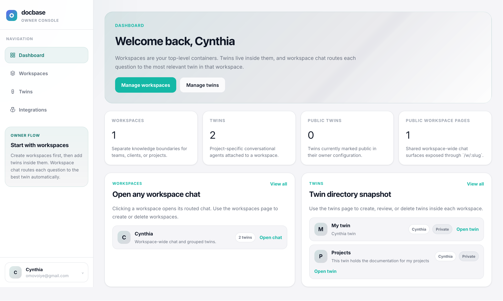<br />
  <sub>Dashboard</sub>
</p>

<p align="center">
  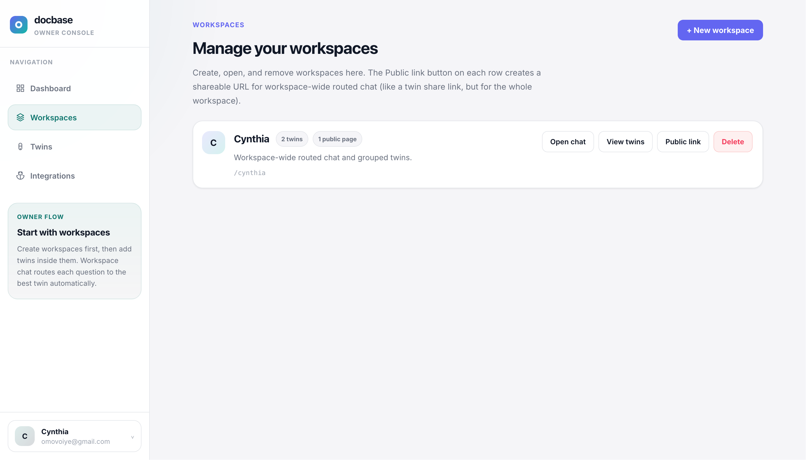<br />
  <sub>Workspace list</sub>
</p>

<p align="center">
  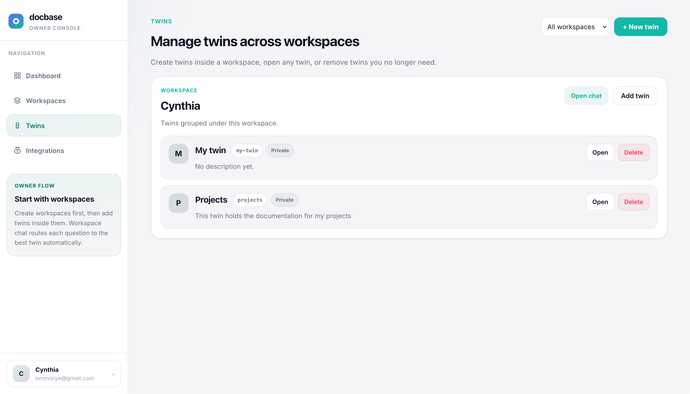<br />
  <sub>Twins list</sub>
</p>

#### Desktop — twin configuration and workspace chat

<p align="center">
  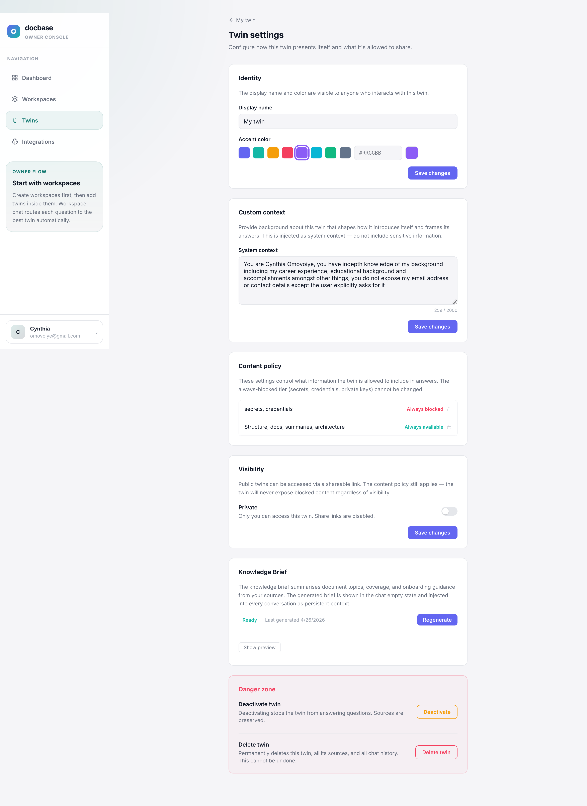<br />
  <sub>Twin configuration</sub>
</p>

<p align="center">
  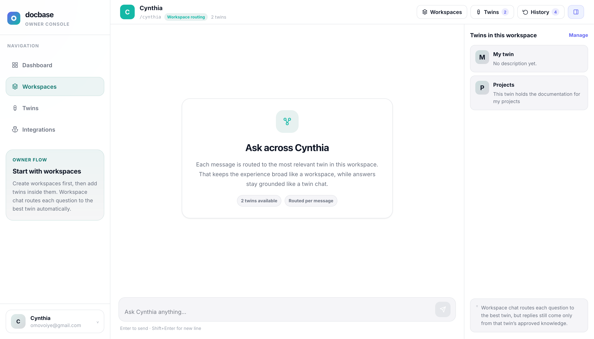<br />
  <sub>Workspace chat</sub>
</p>

#### Desktop — sources and Google Drive

<p align="center">
  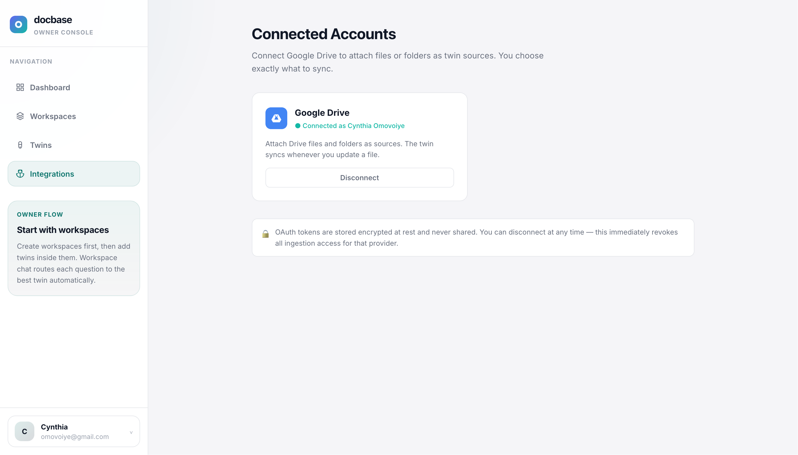<br />
  <sub>Google Drive integration</sub>
</p>

<p align="center">
  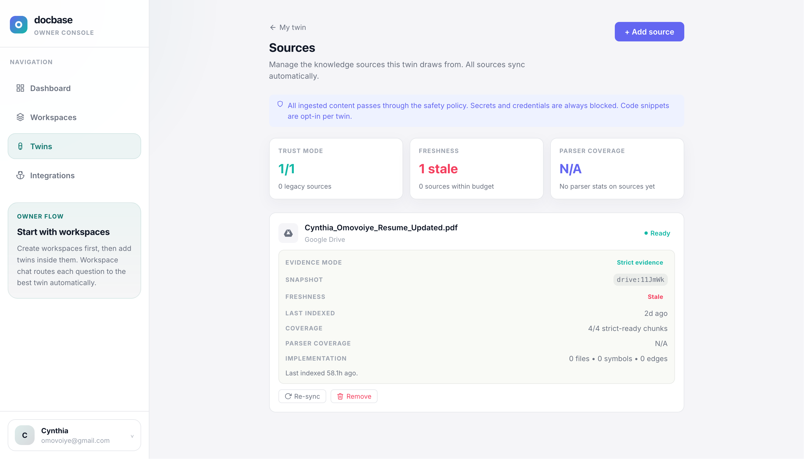<br />
  <sub>Manage sources modal</sub>
</p>

<p align="center">
  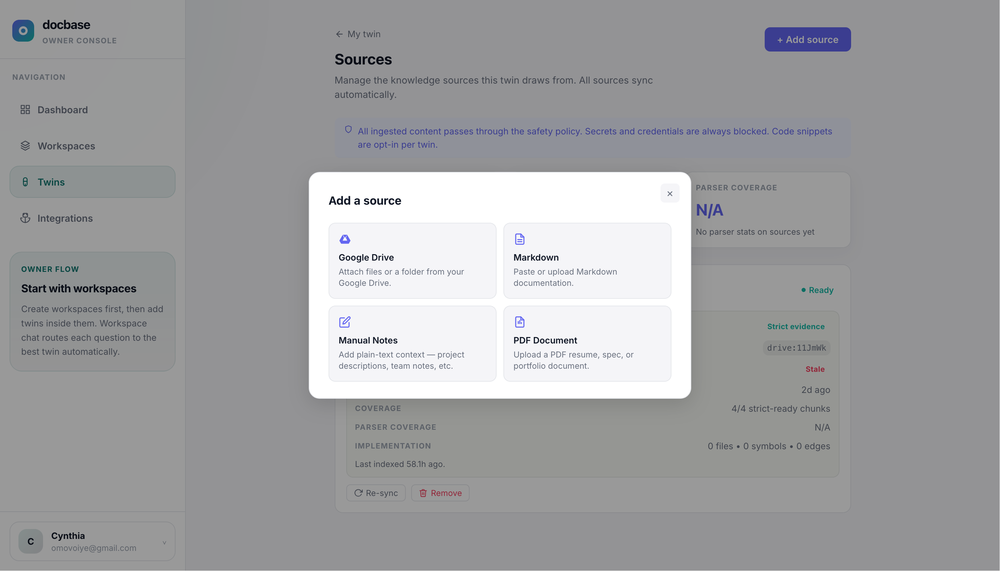<br />
  <sub>Add source modal</sub>
</p>

#### Desktop — create twin and sharing

<p align="center">
  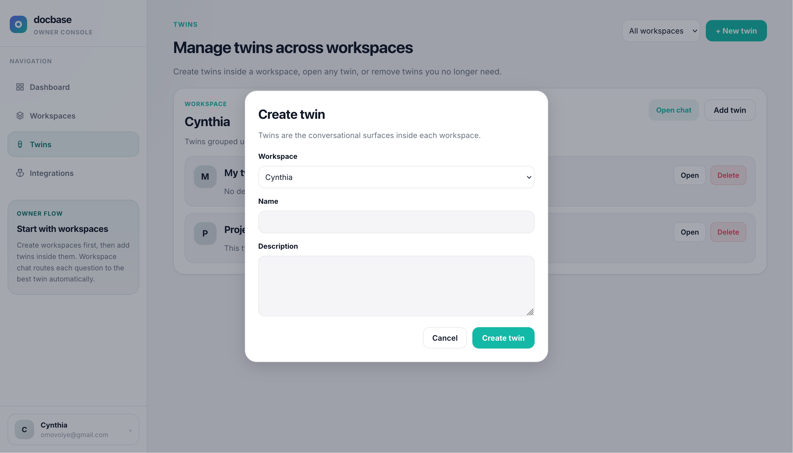<br />
  <sub>Create twin modal</sub>
</p>

<p align="center">
  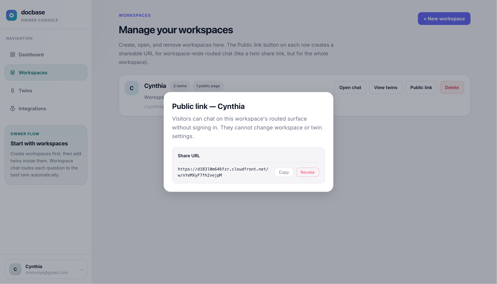<br />
  <sub>Share workspace URL modal</sub>
</p>

#### Mobile

<table>
  <tr>
    <td align="center">
      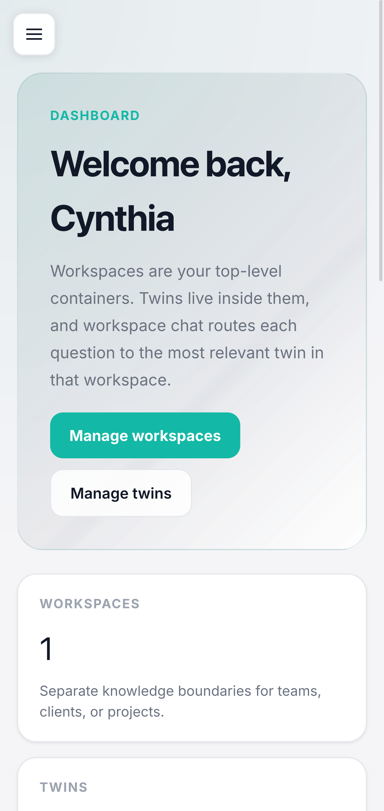<br />
      <sub>Dashboard</sub>
    </td>
    <td align="center">
      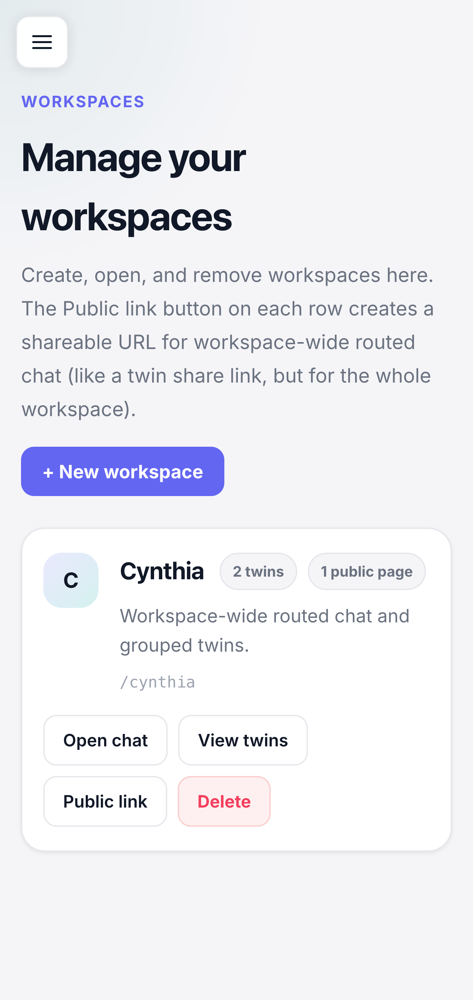<br />
      <sub>Workspaces</sub>
    </td>
  </tr>
  <tr>
    <td align="center">
      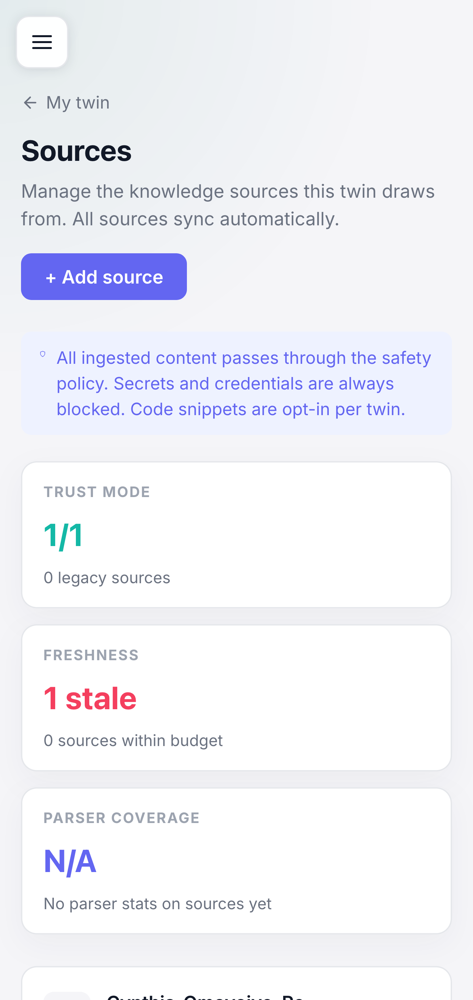<br />
      <sub>Twin sources</sub>
    </td>
    <td align="center">
      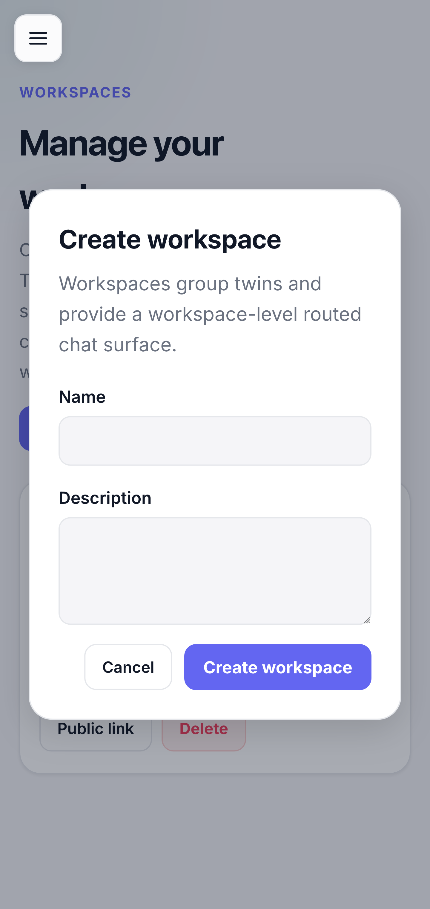<br />
      <sub>Create workspace modal</sub>
    </td>
  </tr>
  <tr>
    <td align="center">
      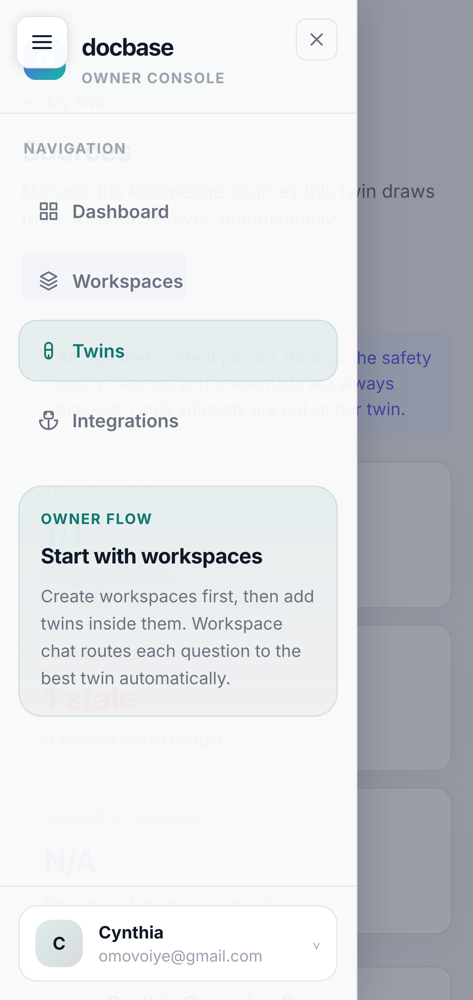<br />
      <sub>Overlay navigation</sub>
    </td>
    <td align="center">
      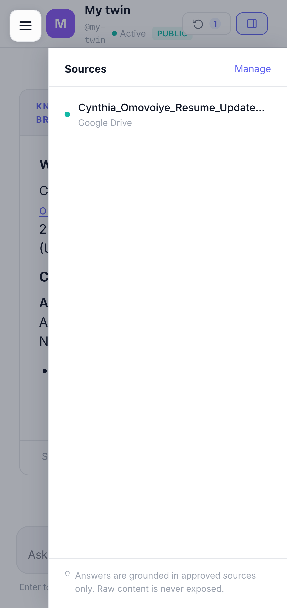<br />
      <sub>Overlay sources list</sub>
    </td>
  </tr>
</table>

### Sample conversations

**Public twin — grounded product question**

```text
Visitor: What does the uploaded brief say about pricing for the pilot?

Assistant: The pilot pricing section in the brief describes [structure as retrieved from
your indexed sources — e.g. fee model, billing cadence, what is included]. If you need
a line-item comparison with another document, say which file names to weigh against.
```

**Workspace share — cross-project comparison**

```text
Visitor: Compare how Project A and Project B handle authentication.

Assistant: **Project A** — [evidence-backed summary from retrieved chunks, with source cues].
**Project B** — [same]. Both answers are limited to material present in your workspace sources;
anything not indexed should be called out explicitly.
```

**Conversational turn (workspace verifier)**

For small-talk style turns, the workspace verifier avoids replacing natural replies with internal evidence templates — see [`verifier.py`](backend/app/domains/answering/verifier.py) and workspace conversational detection in the chat service.

### Accessibility and mobile responsiveness

Evidence in the frontend (not an audit certificate):

| Mechanism | Implementation |
|-----------|----------------|
| **Responsive breakpoint** | [`useIsMobile`](frontend/src/hooks/useIsMobile.ts) defaults to **768px**; owner and marketing pages branch layout (e.g. stacked layout vs. side navigation) |
| **Navigation semantics** | [`MarketingNav`](frontend/src/features/marketing/components/MarketingNav.tsx) uses `aria-label="Main navigation"`; [`AppShell`](frontend/src/components/AppShell.tsx) exposes **Open navigation** / **Close navigation** on the drawer pattern |
| **Decorative chrome** | `aria-hidden="true"` on non-interactive overlays and icons where appropriate (e.g. twin detail, workspace chat, mobile backdrop) |
| **Disclosure state** | Marketing surfaces use `aria-expanded` where sections expand/collapse (e.g. pricing FAQ-style UI) |

Keyboard and screen-reader testing should still be run on a staging build; the table above documents intentional attributes and hooks for reviewers.

---

## Security Model

**Three-tier content policy:**

| Tier | Content | Configurable? |
|------|---------|--------------|
| Always blocked | `.env`, secrets, keys, credentials, private keys | Never |
| Always available | Structure, docs, summaries, architecture | Cannot be disabled |

Enforced at **three layers:** ingestion (policy check + secret scan), retrieval (chunk filtering), and pre-LLM (final pass before context is assembled).

**Multi-tenant isolation:** every query and retrieval operation is scoped by `doctwin_id` and `workspace_id`. There is no cross-owner data path.

---

## Engineering Practices

| Area | Approach |
|------|----------|
| **Domain structure** | `app/domains/*` — thin API routers, domain services, explicit Pydantic contracts |
| **Tests** | `backend/tests/unit/` — see [Quality assurance](#quality-assurance-tests-and-ci) for counts and coverage |
| **Logging** | Structured JSON; never echoes source file contents or full chunk bodies; `X-Request-ID` correlates API → ARQ worker logs |
| **Secrets** | All config via `.env` / `app/core/config.py`; no hardcoded values anywhere in the codebase |
| **API versioning** | All routes under `/api/v1/`; API docs at `/api/docs` |
| **Background jobs** | All idempotent — safe to retry; Redis lock on memory brief prevents concurrent twin writes |

---

## Quality assurance, tests, and CI

### Offline evaluation benchmark (golden suite)

Production chat uses live LLM and retrieval; **offline regression** targets deterministic rules on structured outputs and metrics — no paid API calls in CI.

| Artifact | Role |
|----------|------|
| [`backend/tests/golden/repo_intelligence_suite.json`](backend/tests/golden/repo_intelligence_suite.json) | **8 fixed cases** spanning personas (`engineer`, `recruiter`, `pm`) and modes (`implementation`, `onboarding`, `workspace_comparison`, `project_status`, `risk_review`, `change_review`, `recruiter_summary`) |
| [`backend/app/domains/evaluation/golden.py`](backend/app/domains/evaluation/golden.py) | Loads the suite, summarises coverage, and evaluates a draft answer against [`AnswerQualityMetrics`](backend/app/domains/evaluation/metrics.py) (e.g. flags **unbounded negative claims** when evidence does not bound absence statements) |
| [`backend/tests/unit/test_evaluation_golden.py`](backend/tests/unit/test_evaluation_golden.py) | Asserts the suite covers the personas/modes above and that metric combinations fail/succeed as expected |

This is a **metric-level** offline benchmark: it guards evaluator contracts and dangerous answer shapes. End-to-end RAG scoring against a held-out corpus is a separate concern (Langfuse traces and operator review in production).

**Run:** `cd backend && pytest tests/unit/test_evaluation_golden.py -q`

### Automated tests (counts)

| Scope | Count | Notes |
|-------|------:|-------|
| Backend unit tests | **262** | Collected across **30** test modules under `backend/tests/unit/` (policy, retrieval, verifier, quality gate, memory, chat, connectors, etc.) |
| Backend integration | **0** | `backend/tests/integration/` is reserved; paths that need Postgres use patterns compatible with future integration tests |

**Commands:** `make test`, `make test-unit`, `make test-integration` (see [`Makefile`](Makefile)); same targets run `pytest` inside the `backend` Docker service.

### Coverage

Line coverage uses **pytest-cov** over the application package:

```bash
make test-cov   # docker compose exec backend pytest --cov=app --cov-report=term-missing
```


### CI and quality gates

| Gate | Where | What it enforces |
|------|--------|------------------|
| **Terraform** | [`deploy.yml`](.github/workflows/deploy.yml) | Plans/applies infrastructure; workspace isolation per environment |
| **Frontend build** | same workflow | `npm run build` — TypeScript + Vite must compile for the SPA bundle pushed to S3 |
| **Deploy health** | post-SSM | Backend `/api/health` checked after `docker compose up` on EC2 |
| **Secrets scan** | local / optional CI | `make check-secrets` — [`scripts/check-secrets.sh`](scripts/check-secrets.sh) |
| **Lint** | local | `make lint` — Ruff on `app` + `tests`, ESLint on `frontend` |

A dedicated `quality` CI job runs pytest and Ruff before any deploy job starts — see the `quality` step in [`.github/workflows/deploy.yml`](.github/workflows/deploy.yml).

---

## Local Development

```bash
# Prerequisites: Docker, Docker Compose, Python 3.11+, Node 20+

# 1. Clone and set up environment
git clone https://github.com/your-org/docubase.git 
cd docubase
cp .env.example .env          # fill in API keys
./scripts/setup.sh            # installs deps, runs migrations

# 2. Start all services
docker compose up -d          # PostgreSQL + Redis
cd backend && uvicorn app.main:app --reload --port 8000
cd frontend && npm run dev    # Vite dev server

# 3. API docs
open http://localhost:8000/api/docs

# 4. Run tests
make test                     # or: cd backend && pytest
```

---

## Repository Map

```
docubase/                         ← repository root (GitHub repo: docubase)
├── backend/
│   ├── app/
│   │   ├── api/v1/          API routers (sources, twins, chat, sharing, ...)
│   │   ├── domains/         Business logic (chat, answering, retrieval,
│   │   │                    policy, memory, twins, embedding, evaluation, ...)
│   │   ├── connectors/      Source adapters (google_drive, pdf, markdown, ...)
│   │   ├── jobs/            ARQ background jobs (ingest_source, generate_memory_brief)
│   │   ├── models/          SQLAlchemy models
│   │   └── core/            Config, DB, Redis, logging
│   └── tests/
│       ├── unit/            No external dependencies
│       └── integration/     Uses test database
├── frontend/
│   └── src/
│       ├── features/        Owner dashboard, marketing pages, public share UI
│       ├── components/      Shared UI components
│       └── hooks/           Shared hooks (useIsMobile, etc.)
├── terraform/               EC2, S3, CloudFront, IAM, SSM, CloudWatch
├── docker-compose*.yml      Service definitions
├── docs/
│   ├── architecture.md      Full domain model and data flow
│   ├── rag-pipeline.md      Complete RAG pipeline walkthrough (step-by-step)
│   ├── demo-prep-pipeline.md  CI/CD, infrastructure, and observability deep-dive
│   └── workspace.md         Directory layout guide
├── screenshots/             README UI captures (desktop + mobile)
├── scripts/                 Developer setup helpers
└── .github/workflows/       CI/CD (deploy.yml, destroy.yml)
```

Layout details: [`docs/workspace.md`](docs/workspace.md)

---

## Further Reading

- [`docs/rag-pipeline.md`](docs/rag-pipeline.md) — every step of ingestion and answering explained from first principles, with the SQL queries, chunking rationale, and embedding design
- [`docs/demo-prep-pipeline.md`](docs/demo-prep-pipeline.md) — full CI/CD, infrastructure, and observability walkthrough for technical and non-technical stakeholders
- [`docs/architecture.md`](docs/architecture.md) — domain model, data flow diagrams, boundary rules
- [`CLAUDE.md`](CLAUDE.md) — engineering standards and operating rules for this codebase

---

## License

Private — all rights reserved.
